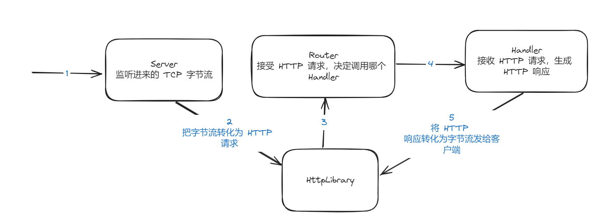

# 内容说明
### 主要学习杨旭老师的《基于Rust的全栈开发》课程，并做笔记和代码实现，完成了一个典型的 tcpserver 的流程，并 mock 了部分响应

### 课程链接
https://www.bilibili.com/video/BV1RP4y1G7KF?p=7&spm_id_from=pageDriver&vd_source=d91f5e3d12d580377ac29cf325c122fd

### 启动
```Rust
    cargo run -p httpserver
```
### 运行效果测试
http://127.0.0.1:7878

## 典型 httpserver 的数据流向

